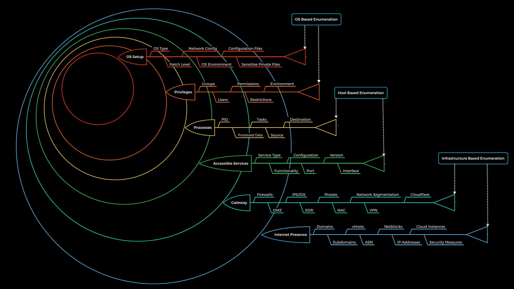

The whole enumeration process is divided into three different levels:
    1. Infrastructure-based enumeration 	
    2. Host-based enumeration 	
    3. OS-based enumeration

These layers are designed as follows:

1. Internet Presence 	
    - Description: Identification of internet presence and externally accessible infrastructure. 	
    - Categories: Domains, Subdomains, vHosts, ASN, Netblocks, IP Addresses, Cloud Instances, Security Measures
    - The goal of this layer is to identify all possible target systems and interfaces that can be tested. 

2. Gateway
    - Description: Identify the possible security measures to protect the company's external and internal infrastructure. 	
    - Categories: Firewalls, DMZ, IPS/IDS, EDR, Proxies, NAC, Network Segmentation, VPN, Cloudflare
    - The goal is to understand what we are dealing with and what we have to watch out for.

3. Accessible Services 	
    - Description: Identify accessible interfaces and services that are hosted externally or internally. 	
    - Categories: Service Type, Functionality, Configuration, Port, Version, Interface
    -This layer aims to understand the reason and functionality of the target system and gain the necessary knowledge to communicate with it and exploit it for our purposes effectively.

4. Processes 	
    - Description: Identify the internal processes, sources, and destinations associated with the services. 	
    - Categories: PID, Processed Data, Tasks, Source, Destination
    - The goal here is to understand these factors and identify the dependencies between them.

5. Privileges 	
    - Description: Identification of the internal permissions and privileges to the accessible services. 	
    - Categories: Groups, Users, Permissions, Restrictions, Environment
    - It is crucial to identify these and understand what is and is not possible with these privileges.

6. OS Setup 	
    - Description: Identification of the internal components and systems setup. 	
    - Categories: OS Type, Patch Level, Network config, OS Environment, Configuration files, sensitive private files
    - The goal here is to see how the administrators manage the systems and what sensitive internal information we can glean from them.